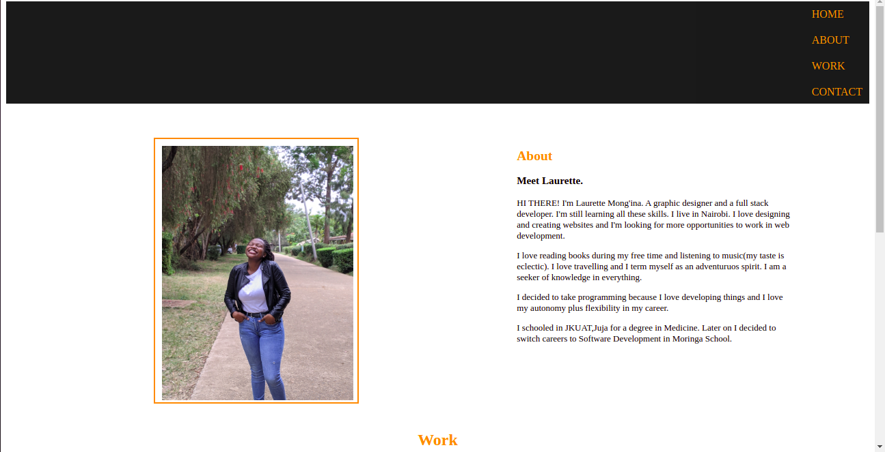
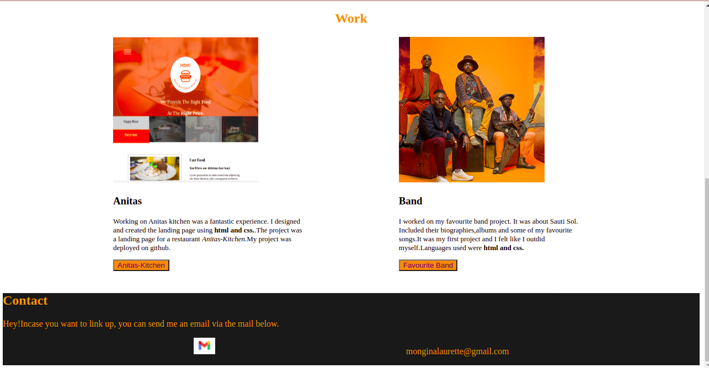

# PORTFOLIO_PROJECT
#### It's about my portfolio, Who Iam, what I do, education background, work I have done and my relevant skills. 2021.
#### By Laurette Mong'ina.
## My Portfolio
My portfolio project is about my portfolio. It has an about section that basically describes who I am, what I do, what I enjoy doing and my education background. It also states some of my relevant skills.
The Work Section is about the work I have done previously, the languages I used and what the work was all about. It also includes some of the languages I used.

## Requirements
<ul>
<li>A code editor(vscode)</li>
<li>A github account</li>
<li>Internet.</li>
</ul>
## Setup/Installation
<ul>
<li>Clone this repository to your machine</li>
<li>Navigate to the top level of your directory.</li>
<li>Open the index.html in your browser</li>
</ul>
## Known Bugs
My website is not fully responsive, working towards correcting that using bootstrap.
## Technologies Used
I used HTML AND CSS to create this portfolio. HTML for the structure and css for the styling. I used vscode as my code editor and deployed on Github.
## Support and contact details
In case of any issues or you have question, concerns, ideas to implement and contributions, be sure to reach out to me via email (monginalaurette@gmail.com). Any contributions will be highly appreciated.Pull requests are highly welcome.
### License
[MIT].
Copyright (c) 2021 by Laurette Mong'ina.